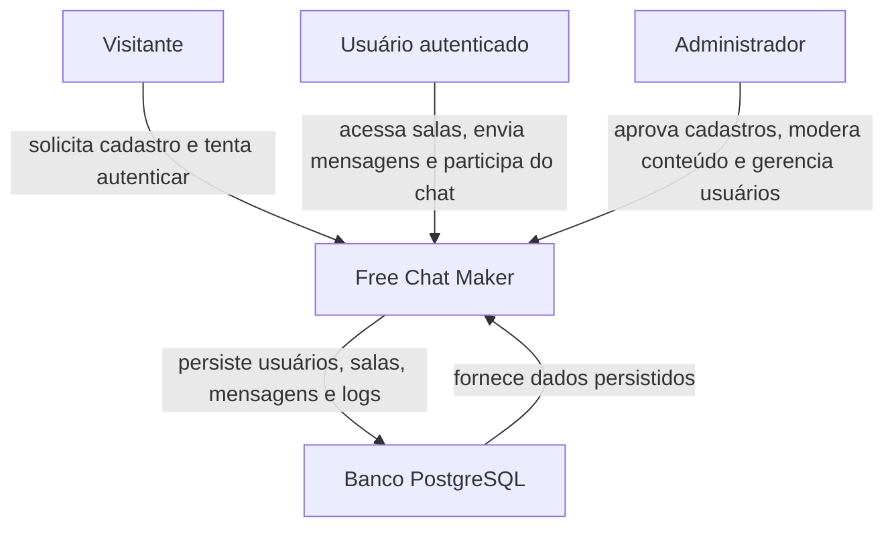
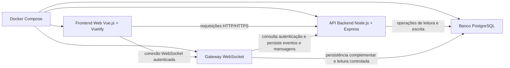
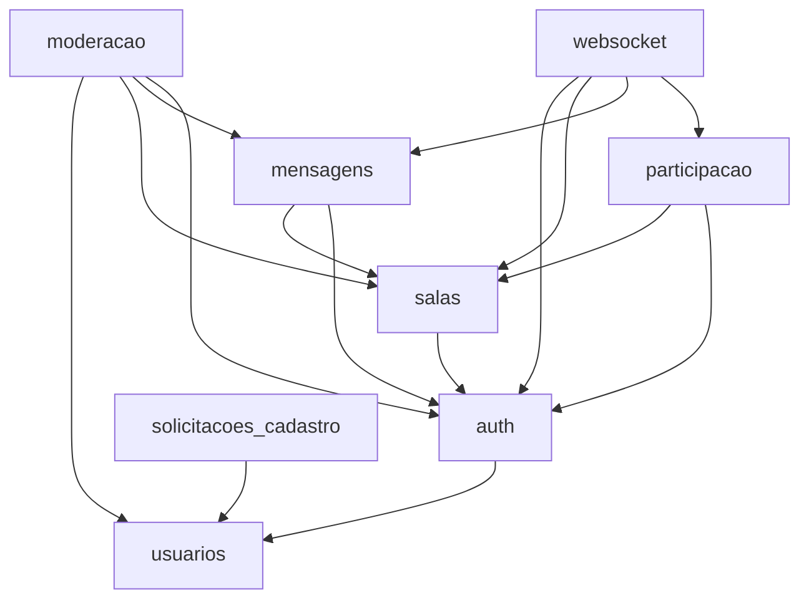
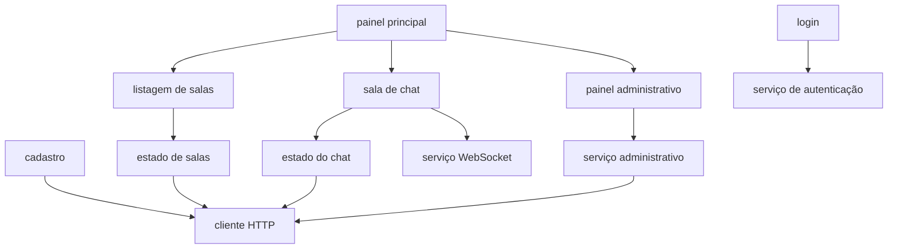

# architecture-design.md

## Objetivo

Este documento descreve a arquitetura do sistema **Free Chat Maker** de forma técnica e implementável, conectando o domínio de negócio, a persistência relacional, a comunicação em tempo real e a organização interna da aplicação.

Seu papel dentro da abordagem **Spec-Driven Development (SDD)** é transformar os requisitos, regras de negócio, entidades e fluxos principais em uma estrutura arquitetural coerente, capaz de orientar decisões de implementação no frontend, backend, banco de dados e infraestrutura.

Este artefato deve servir como base para:

* organização dos módulos do backend
* definição das responsabilidades entre API HTTP e WebSocket
* implementação da autenticação e autorização
* integração com o banco PostgreSQL via Sequelize
* evolução controlada do sistema sem perda de consistência

---

## Visão arquitetural

O **Free Chat Maker** é uma aplicação web institucional voltada à comunicação entre alunos, professores, funcionários e administradores por meio de salas públicas. O sistema possui frontend e backend separados, com responsabilidades bem definidas.

No lado do cliente, a aplicação web em **Vue.js** e **Vuetify** é responsável pela interface, navegação, gerenciamento de estado de tela e interação do usuário com funcionalidades como login, cadastro, listagem de salas, chat em tempo real e painel administrativo.

No lado do servidor, o backend em **Node.js** com **Express** oferece dois canais principais:

* uma **API HTTP** para operações síncronas e orientadas a recurso, como autenticação, cadastro, CRUD de salas, recuperação de histórico e ações administrativas
* um canal de **WebSocket** para troca de mensagens em tempo real, eventos de participação e notificações operacionais do chat

A persistência é relacional e centralizada em **PostgreSQL**, com acesso mediado por **Sequelize**. O banco armazena usuários, solicitações de cadastro, salas, mensagens, eventos de participação e logs de moderação.

Do ponto de vista de segurança e governança, a arquitetura contempla:

* autenticação por CPF e senha
* geração de JWT para sessão autenticada
* controle de acesso baseado em papéis
* moderação administrativa centralizada
* rastreabilidade mínima obrigatória para ações críticas

Essa arquitetura foi definida para preservar simplicidade operacional na versão inicial, sem abrir mão de organização modular, controle de estados e capacidade de evolução futura.

---

## Estilo arquitetural adotado

O sistema adota uma combinação de estilos arquiteturais adequados ao seu contexto funcional e tecnológico.

### 1. Arquitetura cliente-servidor

O frontend e o backend são implantados como componentes separados, com comunicação por HTTP e WebSocket. Essa divisão reduz acoplamento entre interface e regras de negócio, facilita manutenção e permite evolução independente das camadas.

### 2. Backend modular

O backend é organizado por módulos de negócio, e não por agrupamento puramente técnico. Essa decisão facilita evolução por domínio, reduz impacto cruzado entre funcionalidades e melhora a rastreabilidade entre requisitos e implementação.

### 3. Camada HTTP em estilo MVC

A borda HTTP do sistema pode seguir organização em estilo MVC, com rotas, controllers, validações e responses. Essa escolha é adequada para o Express, melhora a clareza da API e mantém o tratamento de requisição separado das regras centrais.

### 4. Separação interna inspirada em Clean Architecture

Internamente, cada módulo deve separar responsabilidades entre:

* entrada da aplicação
* regras de negócio
* acesso a dados
* integração com infraestrutura

Essa organização reduz dependência direta entre domínio e framework, facilita testes e evita que regras de negócio fiquem distribuídas em controllers ou handlers de socket.

### 5. Comunicação em tempo real via WebSocket

O chat da versão 1 depende de comunicação em tempo real. O uso de WebSocket permite manter sessões conectadas, publicar mensagens imediatamente e notificar eventos de entrada e saída sem polling contínuo.

### 6. Persistência em PostgreSQL

O PostgreSQL foi adotado por suportar bem integridade relacional, constraints, índices e consistência transacional, o que é especialmente importante em fluxos de autenticação, moderação, histórico de mensagens e rastreabilidade.

### 7. RBAC

A arquitetura incorpora **Role-Based Access Control** como mecanismo explícito de autorização. Isso permite que o sistema diferencie ações de `ADMIN`, `ALUNO`, `PROFESSOR` e `FUNCIONARIO` sem espalhar regras informais por toda a aplicação.

---

## Princípios arquiteturais

### Separação de responsabilidades

Cada camada e cada módulo devem ter responsabilidade clara. Interface, regras de negócio, persistência, autenticação, tempo real e moderação não devem ser misturados.

### Baixo acoplamento

Módulos devem depender de contratos e serviços internos estáveis, evitando dependência indevida de detalhes de transporte, ORM ou componentes de tela.

### Alta coesão

Cada módulo deve agrupar comportamentos relacionados ao mesmo domínio funcional, como autenticação, salas, mensagens ou moderação.

### Rastreabilidade

A arquitetura deve permitir rastrear decisões e ações importantes, especialmente em cadastro, autenticação, moderação, envio de mensagens e eventos de participação.

### Evolutividade

A estrutura deve facilitar futura adição de novas regras e funcionalidades, como salas privadas, notificações adicionais e políticas mais detalhadas de moderação, sem exigir reescrita estrutural.

### Segurança básica

A arquitetura deve garantir hash seguro de senha, autenticação com JWT, validação de sessão, verificação de papel e bloqueio de usuários não autorizados.

### Persistência consistente

Toda informação relevante do domínio deve ser persistida de forma confiável. A comunicação em tempo real não substitui a persistência.

### Desacoplamento entre tempo real e armazenamento

O fluxo de WebSocket deve depender das regras de aplicação e da persistência, mas não deve conter diretamente regras de banco ou lógica de moderação embutida. O gateway em tempo real deve orquestrar, e não centralizar toda a lógica do sistema.

---

## Contexto do sistema

O sistema possui três perfis de interação externos principais.

### Visitante

Representa a pessoa que ainda não possui acesso autenticado ou ainda não foi aprovada. Pode solicitar cadastro e acessar a interface inicial de autenticação.

### Usuário autenticado

Representa aluno, professor ou funcionário aprovado, autenticado e autorizado a usar salas públicas, histórico de mensagens e comunicação em tempo real.

### Administrador

Representa o usuário com papel administrativo responsável por aprovação de cadastros, bloqueio de usuários, moderação de mensagens, intervenção em salas e consulta de rastros administrativos.

---

## Diagrama de contexto

---

## Diagrama de containers

---

## Diagrama de módulos do backend

---

## Diagrama de módulos do frontend

---

## Fluxo de autenticação

O fluxo de autenticação deve ser centralizado no módulo `auth` e compartilhado entre API HTTP e WebSocket.

### 1. Login por CPF e senha

O usuário informa CPF e senha no frontend. A requisição é enviada ao backend por HTTP.

### 2. Verificação do status do usuário

O backend consulta o usuário persistido e valida:

* existência do CPF
* correspondência da senha com o `senha_hash`
* status do usuário
* papel associado

Usuários com status diferente de `APROVADO` não recebem sessão autenticada. Usuários `BLOQUEADO` devem ser explicitamente impedidos de acessar a aplicação.

### 3. Geração de JWT

Após autenticação bem-sucedida, o backend gera um JWT contendo os identificadores necessários para sessão e autorização, como `id`, `papel` e metadados mínimos de expiração.

### 4. Uso do token nas requisições

O frontend passa a enviar o token nas requisições autenticadas para a API. O mesmo token deve ser reaproveitado para a abertura do canal WebSocket, evitando duplicação de mecanismos de autenticação.

### 5. Restrição para usuários bloqueados ou não aprovados

O backend deve validar status do usuário não apenas no login, mas também nas operações protegidas e na conexão WebSocket. Isso evita que um usuário bloqueado continue operando com sessão previamente emitida sem nova validação de contexto.

---

## Fluxo de mensagens em tempo real

O fluxo de mensagens em tempo real deve preservar a seguinte sequência arquitetural.

### 1. Usuário entra na sala

O usuário autenticado seleciona uma sala ativa no frontend. A entrada pode ser registrada pela API e refletida também na camada WebSocket.

### 2. Frontend abre canal WebSocket

Ao acessar a sala de chat, o frontend inicializa ou reutiliza uma conexão WebSocket autenticada, associando o usuário ao contexto da sala.

### 3. Backend valida autenticação e permissão

O gateway WebSocket valida o token, confirma o status do usuário e verifica se a sala existe, está ativa e pode receber interação.

### 4. Mensagem é enviada

Quando o usuário envia uma mensagem, o frontend a entrega ao backend pelo canal WebSocket com o contexto da sala.

### 5. Backend persiste no banco

Antes de fazer broadcast, o backend deve passar a mensagem pela regra de aplicação do módulo `mensagens`, validar conteúdo, autoria e estado da sala, e persistir o registro no PostgreSQL.

### 6. Backend distribui para os clientes conectados

Somente após persistência bem-sucedida a mensagem deve ser distribuída aos clientes conectados àquela sala. Essa ordem reduz risco de mensagens visualizadas sem lastro persistente.

### 7. Eventos de entrada e saída podem gerar persistência e notificação visual

Eventos de participação devem ser tratados pelo módulo `participacao`, podendo:

* registrar entrada ou saída em `eventos_participacao`
* gerar evento visual no frontend
* alimentar rastreabilidade operacional

Essa separação evita confundir presença de usuário com mensagem textual comum.

---

## Fluxo de moderação

O fluxo de moderação deve seguir uma cadeia controlada e auditável.

### 1. Administrador executa ação

O administrador acessa o painel administrativo e solicita uma ação, como aprovar cadastro, bloquear usuário, remover mensagem, silenciar sala ou excluir logicamente uma sala.

### 2. Sistema valida papel ADMIN

O backend valida autenticação, papel `ADMIN` e consistência do alvo da operação.

### 3. Ação afeta usuário, sala ou mensagem

O módulo `moderacao` coordena a operação e delega atualização ao módulo correto:

* `usuarios` para bloqueio
* `solicitacoes_cadastro` para aprovação ou rejeição
* `salas` para silenciamento ou exclusão lógica
* `mensagens` para remoção ou ação administrativa sobre conteúdo

### 4. Ação gera log de moderação

Toda ação administrativa relevante deve gerar registro em `logs_moderacao`, contendo ator, alvo, tipo de ação, motivo e data/hora.

### 5. Ação pode gerar aviso no chat

Quando aplicável, a ação também pode produzir um aviso visível no chat, sem substituir o log administrativo persistente. Isso é especialmente útil para remoção de conteúdo por violação de regra ou fechamento operacional de sala.

---

## Regras de separação de responsabilidades

### Frontend

O frontend cuida de interface, navegação, composição de componentes, estado visual e experiência do usuário. Ele não deve concentrar regras críticas de autorização, estado de sala ou moderação.

### API

A API HTTP cuida de regras de negócio síncronas, validação de entrada, autenticação inicial, operações administrativas, recuperação de histórico e manutenção de recursos persistidos.

### WebSocket

O WebSocket cuida da comunicação em tempo real, entrada em sala, entrega de mensagens e eventos de participação. Ele deve reutilizar regras centrais da aplicação e evitar lógica duplicada em relação à API.

### Banco de dados

O banco cuida da persistência, integridade relacional, constraints, estados de entidades e recuperação confiável dos dados do sistema.

### Moderação e auditoria

Moderação e auditoria devem ser centralizadas em módulos próprios. Isso evita espalhar regras administrativas pelo código de chat e facilita evolução futura das políticas institucionais.

---

## Decisões arquiteturais

### DA-01 — Uso de PostgreSQL

**Decisão**

Adotar PostgreSQL como banco de dados relacional principal do sistema.

**Justificativa**

O sistema exige integridade relacional, consistência de estados, rastreabilidade e consultas confiáveis sobre usuários, salas, mensagens e moderação. O PostgreSQL atende bem esse cenário e integra-se de forma madura ao Sequelize.

**Impacto**

Favorece consistência transacional, uso de índices e modelagem explícita, mas exige cuidado com migrations, constraints e planejamento de consultas de histórico.

### DA-02 — Uso de WebSocket na versão 1

**Decisão**

Adotar WebSocket como mecanismo padrão de comunicação em tempo real já na versão 1.

**Justificativa**

O chat é uma funcionalidade central do sistema. Polling periódico aumentaria latência, desperdício de requisições e complexidade de sincronização da interface.

**Impacto**

Melhora responsividade da experiência de chat, mas exige coordenação rigorosa entre autenticação, persistência e broadcast.

### DA-03 — Backend modular

**Decisão**

Estruturar o backend por módulos de domínio como `auth`, `usuarios`, `solicitacoes_cadastro`, `salas`, `mensagens`, `participacao`, `moderacao` e `websocket`.

**Justificativa**

Os requisitos do sistema já estão naturalmente agrupados por capacidade de negócio. Refletir isso na arquitetura reduz acoplamento funcional e melhora manutenção.

**Impacto**

Facilita crescimento e teste isolado dos módulos, mas exige contratos internos claros para evitar dependências circulares.

### DA-04 — JWT para autenticação

**Decisão**

Utilizar JWT para autenticação e sessão, mantendo hash de senha com bcrypt ou equivalente.

**Justificativa**

JWT permite sessão autenticada simples para integração entre frontend, API e WebSocket. A separação entre autenticação por token e armazenamento de senha com hash mantém clareza do modelo de segurança.

**Impacto**

Simplifica autenticação distribuída entre canais, mas exige política adequada de expiração, assinatura e validação de status do usuário.

### DA-05 — Exclusão lógica para entidades sensíveis

**Decisão**

Priorizar exclusão lógica em salas e mensagens.

**Justificativa**

Essas entidades carregam contexto conversacional, rastreabilidade administrativa e potencial evidência operacional. Remoção física imediata comprometeria auditoria e moderação.

**Impacto**

Preserva histórico e governança, mas demanda filtros consistentes nas consultas para evitar exibição indevida de registros excluídos.

### DA-06 — Logs de moderação imutáveis

**Decisão**

Tratar logs de moderação como registros imutáveis após criação.

**Justificativa**

Logs administrativos só cumprem papel de rastreabilidade quando podem ser confiados como trilha estável. Permitir alteração posterior enfraquece a governança do sistema.

**Impacto**

Fortalece auditabilidade e responsabilização, mas exige disciplina para registrar correções por novos eventos em vez de alterar eventos passados.

---

## Riscos arquiteturais

### Acoplamento entre API e WebSocket

Se regras de validação e domínio forem duplicadas entre controller HTTP e gateway WebSocket, o sistema pode passar a responder de forma inconsistente ao mesmo cenário funcional.

### Crescimento desordenado do módulo de moderação

Como a moderação atravessa usuários, salas e mensagens, existe risco de o módulo se tornar concentrador excessivo de dependências e exceções de regra.

### Mistura de regras administrativas com regras de chat

Se a moderação for implementada diretamente no fluxo comum de mensagens sem camadas claras, o comportamento do chat pode ficar difícil de manter e testar.

### Consultas pesadas em histórico

A recuperação de histórico por sala pode crescer rapidamente em volume, especialmente se a rastreabilidade administrativa e eventos de sistema forem tratados de forma ingênua.

### Inconsistência entre broadcast e persistência

Se o sistema fizer broadcast antes da persistência confirmada, clientes podem visualizar mensagens ou eventos que não possuem registro confiável no banco.

---

## Observações para implementação

A implementação deve manter alinhamento explícito entre pastas, módulos e responsabilidades.

### Organização de pastas

No backend, recomenda-se uma estrutura por módulo, por exemplo:

* `src/modules/auth`
* `src/modules/usuarios`
* `src/modules/solicitacoes-cadastro`
* `src/modules/salas`
* `src/modules/mensagens`
* `src/modules/participacao`
* `src/modules/moderacao`
* `src/modules/websocket`

Dentro de cada módulo, a separação pode seguir camadas como:

* `controllers`
* `services`
* `repositories`
* `validators`
* `models`
* `gateways` quando necessário

### Controllers, services, repositories e gateways

* `controllers` devem tratar entrada e saída HTTP
* `services` devem concentrar regras de aplicação
* `repositories` devem abstrair acesso ao Sequelize
* `gateways` devem encapsular integração com WebSocket e outros canais de borda

Essa divisão evita que controllers e sockets virem locais de regra de negócio espalhada.

### Consistência entre REST e WebSocket

REST e WebSocket devem reutilizar os mesmos serviços de aplicação para validação, autorização, criação de mensagem e registro de participação. O transporte muda; a regra central não.

### Autenticação compartilhada

A autenticação deve ser compartilhada entre API e WebSocket por meio de validação centralizada de JWT. O sistema também deve consultar o status atual do usuário nas operações críticas, para impedir atuação de usuários bloqueados após emissão do token.

### Preparação para evolução futura

A arquitetura deve ser preparada para evolução sem ruptura estrutural. Em especial:

* permitir expansão do módulo de moderação
* suportar novos tipos de evento em tempo real
* admitir novas políticas de visibilidade de sala
* possibilitar futura separação entre gateway WebSocket e API em processos distintos, se o volume crescer

### Tratamento de persistência e tempo real

Mensagens e eventos importantes devem ser persistidos antes de broadcast definitivo. Quando houver falha de persistência, o sistema não deve confirmar visualmente o evento como efetivado.

### Padronização de contratos

Recomenda-se padronizar DTOs, payloads HTTP e eventos WebSocket com nomenclatura coerente ao domínio em português, preservando legibilidade entre documentação, banco e código.

