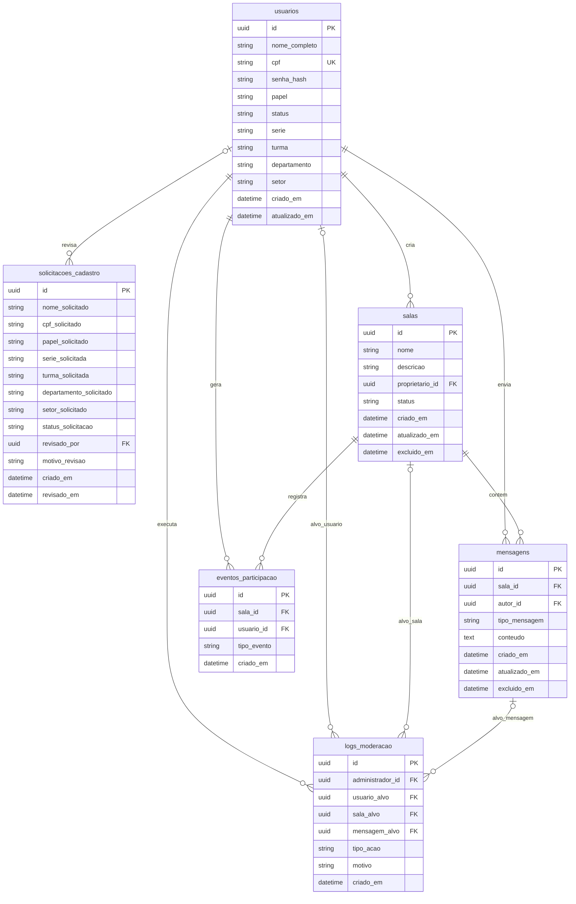
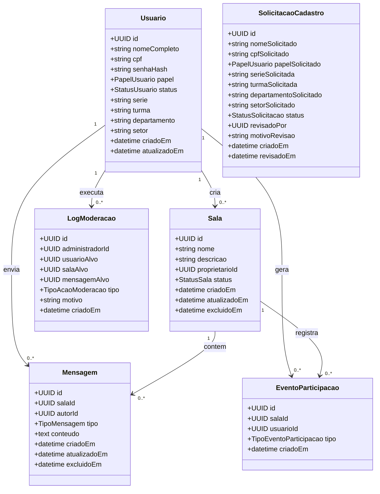
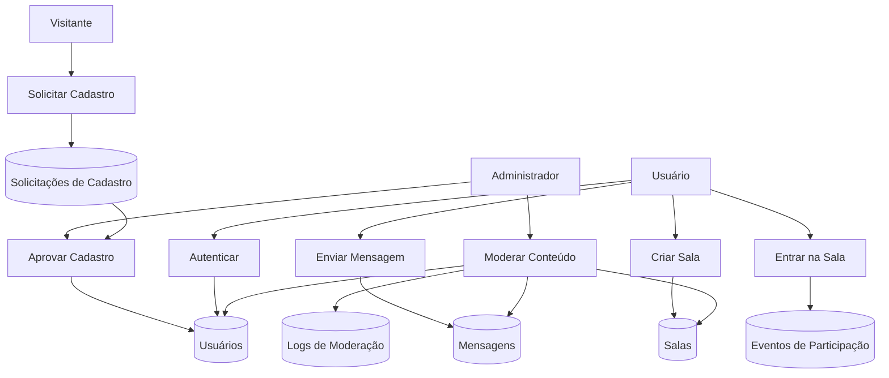

# database-design.md

## Objetivo

Este documento descreve o desenho do banco de dados do sistema **Free Chat Maker**. Seu objetivo é transformar o modelo de domínio em uma estrutura relacional persistente, definindo tabelas, atributos, chaves, relacionamentos, regras de integridade e visões diagramáticas que sirvam de base para:

* criação de migrations
* implementação dos models com Sequelize
* definição das associações entre entidades
* construção da API
* implementação das regras de negócio
* integração com comunicação em tempo real via WebSocket

Este artefato deve manter coerência com a spec funcional, com o modelo de domínio e com os fluxos principais do sistema.

---

## Premissas de modelagem

A modelagem do banco de dados do Free Chat Maker parte das seguintes premissas:

### 1. Banco de dados relacional

O sistema utilizará **PostgreSQL** como mecanismo de persistência principal. A escolha se justifica por:

* suporte robusto a integridade relacional
* boa compatibilidade com Sequelize
* suporte a índices, constraints e tipos enumerados
* adequação para aplicações institucionais e multiusuário

### 2. Persistência orientada ao domínio

As tabelas foram definidas a partir das entidades centrais do domínio, e não apenas de necessidades imediatas de interface. Isso favorece:

* evolução futura do sistema
* clareza semântica
* manutenção mais segura
* melhor rastreabilidade entre regra de negócio e estrutura persistente

### 3. ORM previsto

A camada de persistência será implementada com **Sequelize**, mantendo correspondência entre:

* entidade de domínio
* model ORM
* tabela relacional

### 4. Exclusão lógica quando necessário

Entidades sensíveis à auditoria ou rastreabilidade devem priorizar exclusão lógica, especialmente:

* salas
* mensagens

Isso será representado por campos como `excluido_em`, preservando histórico e consistência administrativa.

### 5. Controle de acesso por papéis

O sistema deve operar com **RBAC (Role-Based Access Control)**, com os seguintes papéis:

* `ADMIN`
* `ALUNO`
* `PROFESSOR`
* `FUNCIONARIO`

O banco deve suportar essa distinção de forma clara por meio do atributo `papel` da entidade `usuarios`.

### 6. Estados explícitos de entidades

O sistema possui ciclos de vida importantes que precisam ser representados no banco. Em especial:

#### Status do usuário

* `PENDENTE`
* `APROVADO`
* `BLOQUEADO`
* `REJEITADO`

#### Status da sala

* `ATIVA`
* `SILENCIADA`
* `EXCLUIDA`

#### Tipo da mensagem

* `TEXTO`
* `CODIGO`
* `EVENTO_SISTEMA`
* `AVISO_MODERACAO`

#### Tipo de evento de participação

* `ENTRADA`
* `SAIDA`

### 7. Rastreabilidade obrigatória

O sistema deve preservar trilhas mínimas de auditoria para:

* criação e revisão de cadastros
* mensagens
* participação em salas
* ações administrativas e de moderação

### 8. Suporte a tempo real com persistência

O uso de **WebSocket** deve permitir comunicação em tempo real sem substituir a persistência relacional. Toda informação relevante do chat deve continuar sendo registrada no banco.

---

## Entidades e tabelas

A seguir estão as entidades persistentes principais do sistema e a função de cada tabela.

### 1. `usuarios`

Armazena os usuários do sistema, incluindo administradores, alunos, professores e funcionários.

#### Responsabilidades

* identificar o usuário de forma única
* armazenar credenciais seguras
* registrar papel e status de acesso
* manter dados institucionais mínimos por perfil

#### Campos principais

* `id`
* `nome_completo`
* `cpf`
* `senha_hash`
* `papel`
* `status`
* `serie`
* `turma`
* `departamento`
* `setor`
* `criado_em`
* `atualizado_em`

#### Observações

* `serie` e `turma` são mais relevantes para alunos
* `departamento` é aplicável principalmente a professores
* `setor` é aplicável principalmente a funcionários

---

### 2. `solicitacoes_cadastro`

Armazena as solicitações de acesso feitas por usuários ainda não aprovados.

#### Responsabilidades

* registrar pedidos de cadastro
* permitir análise posterior pelo administrador
* manter histórico de decisão administrativa

#### Campos principais

* `id`
* `nome_solicitado`
* `cpf_solicitado`
* `papel_solicitado`
* `serie_solicitada`
* `turma_solicitada`
* `departamento_solicitado`
* `setor_solicitado`
* `status_solicitacao`
* `revisado_por`
* `motivo_revisao`
* `criado_em`
* `revisado_em`

#### Observações

* toda solicitação nasce com status inicial de pendência
* uma solicitação aprovada deve viabilizar a criação ou ativação de um usuário

---

### 3. `salas`

Armazena as salas públicas do sistema.

#### Responsabilidades

* representar ambientes públicos de conversa
* vincular a sala ao seu proprietário
* controlar o estado operacional da sala

#### Campos principais

* `id`
* `nome`
* `descricao`
* `proprietario_id`
* `status`
* `criado_em`
* `atualizado_em`
* `excluido_em`

#### Observações

* toda sala deve possuir um proprietário
* o proprietário é o usuário que criou a sala
* o administrador pode intervir mesmo não sendo proprietário

---

### 4. `mensagens`

Armazena as mensagens enviadas dentro das salas.

#### Responsabilidades

* registrar o conteúdo enviado
* associar a mensagem à sala e ao autor
* permitir tipos distintos de conteúdo
* sustentar histórico e rastreabilidade

#### Campos principais

* `id`
* `sala_id`
* `autor_id`
* `tipo_mensagem`
* `conteudo`
* `criado_em`
* `atualizado_em`
* `excluido_em`

#### Observações

* a tabela pode armazenar mensagens humanas e registros exibíveis do sistema
* mensagens de tipo `CODIGO` representam envio de script ou trecho de código
* mensagens excluídas devem preferencialmente ser preservadas logicamente

---

### 5. `eventos_participacao`

Armazena eventos de entrada e saída de usuários nas salas.

#### Responsabilidades

* manter trilha de participação
* registrar entrada e saída de usuários
* apoiar funcionalidades de presença e auditoria

#### Campos principais

* `id`
* `sala_id`
* `usuario_id`
* `tipo_evento`
* `criado_em`

#### Observações

* esta tabela representa o evento persistido
* a eventual exibição desse evento no chat pode gerar uma mensagem separada do tipo `EVENTO_SISTEMA`, sem que ambos sejam a mesma entidade

---

### 6. `logs_moderacao`

Armazena ações administrativas e de moderação.

#### Responsabilidades

* registrar quem executou a ação
* registrar alvo da ação
* registrar motivo e momento da operação
* sustentar auditoria administrativa

#### Campos principais

* `id`
* `administrador_id`
* `usuario_alvo`
* `sala_alvo`
* `mensagem_alvo`
* `tipo_acao`
* `motivo`
* `criado_em`

#### Observações

* nem todo log terá todos os alvos preenchidos
* ao menos um alvo deve existir
* o executor da ação deve possuir papel administrativo

---

## Relacionamentos

A estrutura relacional do sistema é composta pelos seguintes relacionamentos principais.

### Usuário → Sala

Um usuário pode criar várias salas, mas cada sala possui um único proprietário.

**Cardinalidade:**
`usuarios (1) : (N) salas`

---

### Usuário → Mensagem

Um usuário pode enviar várias mensagens, mas cada mensagem possui um único autor.

**Cardinalidade:**
`usuarios (1) : (N) mensagens`

---

### Sala → Mensagem

Uma sala pode conter várias mensagens, mas cada mensagem pertence a uma única sala.

**Cardinalidade:**
`salas (1) : (N) mensagens`

---

### Usuário → Evento de Participação

Um usuário pode gerar vários eventos de participação em salas.

**Cardinalidade:**
`usuarios (1) : (N) eventos_participacao`

---

### Sala → Evento de Participação

Uma sala pode registrar vários eventos de participação.

**Cardinalidade:**
`salas (1) : (N) eventos_participacao`

---

### Usuário Administrador → Solicitação de Cadastro

Um administrador pode revisar várias solicitações de cadastro.

**Cardinalidade:**
`usuarios (1) : (N) solicitacoes_cadastro`, no papel de revisor

---

### Usuário Administrador → Log de Moderação

Um administrador pode executar várias ações administrativas/moderatórias, cada uma registrada em um log.

**Cardinalidade:**
`usuarios (1) : (N) logs_moderacao`

---

### Usuário → Log de Moderação

Um log de moderação pode ter como alvo um usuário específico.

**Cardinalidade:**
`usuarios (0..1) : (N) logs_moderacao`

---

### Sala → Log de Moderação

Um log de moderação pode ter como alvo uma sala específica.

**Cardinalidade:**
`salas (0..1) : (N) logs_moderacao`

---

### Mensagem → Log de Moderação

Um log de moderação pode ter como alvo uma mensagem específica.

**Cardinalidade:**
`mensagens (0..1) : (N) logs_moderacao`

---

## Regras de integridade

A modelagem deve respeitar as seguintes regras de integridade de dados e de consistência semântica.

### Regras de unicidade

* `usuarios.cpf` deve ser único
* `solicitacoes_cadastro.cpf_solicitado` não deve conflitar com um CPF já aprovado no sistema

### Regras de obrigatoriedade

* todo usuário deve possuir:

  * `nome_completo`
  * `cpf`
  * `senha_hash`
  * `papel`
  * `status`
* toda sala deve possuir:

  * `nome`
  * `proprietario_id`
  * `status`
* toda mensagem deve possuir:

  * `sala_id`
  * `autor_id`
  * `tipo_mensagem`
  * `conteudo`
* todo evento de participação deve possuir:

  * `sala_id`
  * `usuario_id`
  * `tipo_evento`
* todo log de moderação deve possuir:

  * `administrador_id`
  * `tipo_acao`
  * `motivo`

### Regras de chave estrangeira

* `salas.proprietario_id` deve referenciar `usuarios.id`
* `mensagens.sala_id` deve referenciar `salas.id`
* `mensagens.autor_id` deve referenciar `usuarios.id`
* `eventos_participacao.sala_id` deve referenciar `salas.id`
* `eventos_participacao.usuario_id` deve referenciar `usuarios.id`
* `solicitacoes_cadastro.revisado_por` deve referenciar `usuarios.id`
* `logs_moderacao.administrador_id` deve referenciar `usuarios.id`
* `logs_moderacao.usuario_alvo` deve referenciar `usuarios.id`
* `logs_moderacao.sala_alvo` deve referenciar `salas.id`
* `logs_moderacao.mensagem_alvo` deve referenciar `mensagens.id`

### Regras de papel e autorização

* `solicitacoes_cadastro.revisado_por` deve referenciar um usuário com papel `ADMIN`
* `logs_moderacao.administrador_id` deve referenciar um usuário com papel `ADMIN`

### Regras de estado

* usuários com status `BLOQUEADO` não podem autenticar nem interagir
* usuários com status diferente de `APROVADO` não podem usar o sistema autenticado
* salas com status `SILENCIADA` não devem aceitar novas mensagens
* salas com status `EXCLUIDA` não devem aparecer como disponíveis ao uso normal

### Regras semânticas

* mensagens vazias ou compostas apenas por espaços não são permitidas
* pelo menos um dos campos abaixo deve estar preenchido em `logs_moderacao`:

  * `usuario_alvo`
  * `sala_alvo`
  * `mensagem_alvo`
* `senha_hash` deve armazenar hash seguro, nunca senha em texto puro
* exclusão de mensagens e salas deve preferencialmente ser lógica
* logs de moderação não devem ser removidos em operação normal

---

## Diagrama ER

---

## Diagrama de classes (visão estrutural)

Este diagrama representa a visão estrutural das entidades centrais do domínio, servindo como ponte entre o modelo conceitual e a persistência. Não representa a implementação final das classes de software, mas sim sua estrutura semântica principal.

---

## Diagrama de fluxo de dados

O diagrama abaixo apresenta uma visão de fluxo de dados e processos do sistema, relacionando entidades externas, processos centrais e depósitos de dados persistentes.

---

## Observações para implementação

### 1. Índices recomendados

Para melhorar desempenho em consultas frequentes, recomenda-se a criação de índices em:

* `usuarios.cpf`
* `mensagens.sala_id`
* `mensagens.autor_id`
* `mensagens.criado_em`
* `eventos_participacao.sala_id`
* `eventos_participacao.usuario_id`
* `logs_moderacao.administrador_id`
* `solicitacoes_cadastro.cpf_solicitado`

### 2. Uso de enums

Sempre que possível, os campos abaixo devem ser modelados com enum controlado na aplicação e, se conveniente, também no banco:

* `usuarios.papel`
* `usuarios.status`
* `solicitacoes_cadastro.status_solicitacao`
* `salas.status`
* `mensagens.tipo_mensagem`
* `eventos_participacao.tipo_evento`
* `logs_moderacao.tipo_acao`

### 3. Exclusão lógica

Recomenda-se exclusão lógica para:

* `salas`
* `mensagens`

Campos `excluido_em` devem ser usados para preservar histórico e permitir auditoria.

### 4. WebSocket e persistência

A comunicação em tempo real via WebSocket não deve substituir a persistência. O fluxo recomendado é:

1. usuário envia evento/mensagem
2. backend valida permissão e integridade
3. backend persiste os dados
4. backend publica o evento em tempo real

Isso evita inconsistência entre o histórico do chat e o estado visto pelos clientes.

### 5. Models Sequelize

Cada tabela deve possuir model próprio no Sequelize, com:

* definição explícita dos campos
* mapeamento das chaves estrangeiras
* validações básicas
* associação declarada com `belongsTo`, `hasMany` e equivalentes

### 6. Separação entre evento persistido e mensagem exibida

É importante não confundir:

* `eventos_participacao`: registro formal de entrada/saída
* `mensagens` com `tipo_mensagem = EVENTO_SISTEMA`: eventual exibição visual no chat

Um evento de participação pode gerar uma mensagem de sistema visível, mas não precisa ser a mesma entidade persistente.

### 7. Estratégia para usuários

Em vez de excluir fisicamente usuários, recomenda-se:

* bloquear
* rejeitar
* manter rastreabilidade mínima

Isso evita perda de vínculo histórico com mensagens, salas e logs.

### 8. Imutabilidade dos logs de moderação

Os registros de `logs_moderacao` devem ser tratados como trilha administrativa. Em operação normal:

* não devem ser editados
* não devem ser removidos
* devem preservar autor, alvo, motivo e data/hora

### 9. Mensagens de código

Mensagens do tipo `CODIGO` devem preservar o conteúdo integral enviado pelo usuário. Caso haja renderização diferenciada no frontend, isso deve ocorrer na camada de apresentação, não no banco.

### 10. Evolução futura

A estrutura aqui proposta permite evolução para:

* salas privadas
* notificações mais sofisticadas
* presença em tempo real
* moderação avançada
* retenção ampliada de auditoria
* analytics de participação

Sem comprometer as entidades centrais já definidas.
